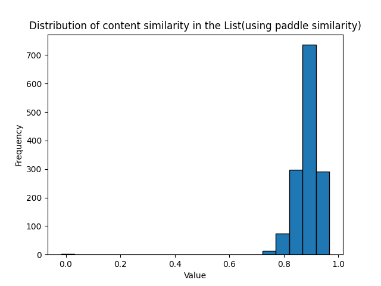

# Synonymous Paraphrasing ChatGLM

## introduction

基于微调实现同义转述的chatGLM

实现效果为，对于一段输入的文本，输出文本为对输入文本的复述和扩写

这样可以实现对数据集的部分扩充

## usage

### step1 下载ChatGLM基础文件

首先根据requirements.txt安装所需库。除了requirements.txt外，还需要根据系统cuda版本安装对应的[paddle](https://www.paddlepaddle.org.cn/install/quick?docurl=/documentation/docs/zh/install/pip/linux-pip.html)

本项目默认使用ChatGLM2-6B模型，因此此时下载ChatGLM2-6B模型权重文件

从 Hugging Face Hub 下载模型需要先[安装Git LFS](https://docs.github.com/zh/repositories/working-with-files/managing-large-files/installing-git-large-file-storage)，然后运行

``git clone https://huggingface.co/THUDM/chatglm2-6b``

如果你从 Hugging Face Hub 上下载 checkpoint 的速度较慢，可以只下载模型实现

``GIT_LFS_SKIP_SMUDGE=1 git clone https://huggingface.co/THUDM/chatglm2-6b``

将下载好的模型实现（chatglm2-6b文件夹）中的内容放到本项目的``workspace/THUDM/chatglm2-6b``文件夹下

然后从这里手动下载模型参数文件，并将下载的文件替换到本项目的``workspace/THUDM/chatglm2-6b``文件夹下

### step2 下载微调文件

从[huggingface](https://huggingface.co/Andrew82106/ChatGLMWithSynonymousParaphrasing)上将微调模型文件克隆到本地，然后本项目中的output文件夹替换为克隆文件中的output文件夹

### step3 调用微调模型

在workspace目录下创建python脚本，使用：

``from Utils.loadTmodel import chatglm_ptuing``

即可调用微调模型

## ptuning

### ptuning data

在文件``workspace/SynonymousParaphrasing.json``中

#### how to get data for ptuning?

对chatGPT3使用如下提示词:

``用中文给我生成一句话，长度大于70字，然后为这句话生成19句同义句，然后将这20句话放在一个python列表里面输出``

不断地重复就可以得到足够的训练数据

### ptuning process

首先根据chatGLM的配置方式配置好chatGLM模型([repo link](https://github.com/THUDM/ChatGLM2-6B))

按照chatGLM模型的readme指导，调整``ptuning``文件夹下的``train.sh``中的部分行，如下所示：

```shell
    --train_file SynonymousParaphrasingDataset/train.json \
    --validation_file SynonymousParaphrasingDataset/test.json \
    ......
    --prompt_column input \
    --response_column output \
    ......
```

然后运行命令``bash train.sh``即可。

## evaluate

我们使用paddle的文本相似度和余弦相似度两种相似度度量方法进行了计算，结果如下：




- demo:

```text
input: 

近期，研究人员发现透明部落利用外贸主题的链接进行攻击活动样本。
样本为一个伪装成xls的scr文件，会释放持久化组件与RAT对中招用户持续监控。
本次攻击活动中使用的RAT既不是其专属木马CrimsonRAT，也不是常用的ObliqueRAT，而是一款简单的RAT，包含屏幕监控、键盘监控、网络传输的功能。
通过持久化组件的特征代码相似度判断这是透明部落的攻击活动，在之前的攻击活动中，透明部落使用了一个持久化组件用于驻留，在此次发现的样本中，同样发现了一个相似的持久化组件，二者的代码相似度很高。
02疑似Kimsuky组织冒充韩国知名网站Naver发起钓鱼攻

output:

最近，一支研究团队发现了一种利用外贸主题的链接进行攻击的方法。
无法在项目中持续运行的程序可能会对数据进行持久化，并在需要时向后推送。
本次攻击活动使用的RAT并非专为木马制造的，而是一款名为ObliqueRAT的简单RAT，能够监测屏幕、键盘和网络的运行状况。
最近，透明部落发现了一个与他们的攻击活动相关的持久化组件，而在此之前，他们使用的持久化组件也很相似。
这两者之间的相似度非常高。
最近，一名韩国学生在网上发布了一段视频，声称自己是纳亚科技的员工，并呼吁大家支持他所在的科技公司。
但实际上，他并非纳亚科技的员工，而是通过伪造身份信息，冒充成了韩国一家公司的员工，企图引起人们的关注。
```

```text
input:

朝鲜攻击者正在使用网络钓鱼网站冒充流行的不可替代代币平台和去中心化金融市场，以窃取价值数千美元的数字资产。
研究人员表示，攻击者设置了近 500 个诱饵站点，包括一个与世界杯相关的项目，以及 NFT 市场 OpenSea、X2Y2 和 Rarible 。
攻击者仅使用其中一个网络钓鱼地址就窃取了 1,055 个 NFT，从而获利 365,000 美元。
攻击者创建虚假的 NFT 相关网站，其中包含旨在欺骗受害者的恶意造币厂。
受害用户将他们的钱包连接到诱饵网站，希望创建 NFT，但却让攻击者可以完全访问其中的资产。
攻击者还记录了访问者数据，并用它来对受害者运行各种攻击脚本。包括访问受害者的访问记录、授权和插件钱包的使用，以及受害者的批准记录和 sigData 等敏感数据。
然后，黑客通过这些信息访问受害者的钱包，暴露他们所有的数字资产，04研究人员发布 Windows 系统内核威胁分析报

output:

#!/pengyun 近日，一名朝鲜攻击者利用网络钓鱼的方式入侵了流行加密资产交易网站，并成功窃取了价值数千美元的数字资产。
最近，一支研究人员团队成功破解了约 500 个目标网站，其中包括与世界杯相关的网站、NFT 市场 OpenSea、X2Y2 和 Rarible。
一名攻击者利用网络钓鱼攻击手段，仅花费了不到 30 美元，就成功盗取了 1,055 个 NFT，赚取了 365,000 美元。
最近，一名攻击者成功入侵了😉 区块链领域的网站，并发布了一枚名为“狗狗”的虚拟加密货币。
不过，这些虚拟货币并非真实存在的，只是通过欺诈手段制造出来的。已在网站上投入的😉金库无法完全保护，被攻击者可以轻松地访问其中的资产。
攻击者能够利用他们的访问权限对目标系统进行攻击，包括运行各种恶意脚本。数据隐私和安全是当今数字化时代的重要问题，尤其是在网络攻击和数据泄露事件中。
对于网站或应用程序的开发者，保护用户数据免受恶意行为的影响是至关重要的。
\n\n 在这种情况下，通过使用安全的数据传输协议，如HTTPS，可以保护数据的机密性，同时加强网站或应用程序的安全性。
除此之外，使用敏感数据的加密和混淆技术也可以避免数据泄露。
最近，一位黑客成功入侵了受害者的账户，并盗取了他的数字货币。这一事件引起了研究人员对Windows系统内核的安全问题的关注。
```